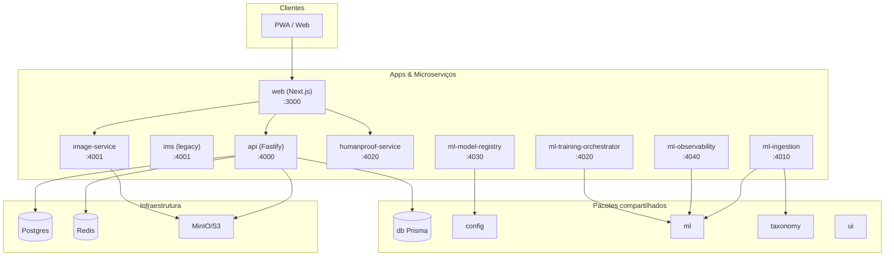

# exibidos.club

Monorepo de produção do **exibidos.club**. Um único repositório com múltiplas apps e pacotes compartilhados.

---

## Arquitetura

### Visão geral

```
                         ┌──────────────────────────────────────────────────────────────────┐
                         │                         Clientes (PWA / Web)                       │
                         └─────────────────────────────────┬────────────────────────────────┘
                                                            │
┌───────────────────────────────────────────────────────────┼───────────────────────────────────────────────────────────┐
│                                                           │                                                           │
│  ┌────────────────────────────────────────────────────────▼────────────────────────────────────────────────────────┐  │
│  │  apps/web (Next.js) · porta 3000                                                                                 │  │
│  │  SSR, App Router, API routes (BFF), auth (NextAuth), upload, busca, feed, swipe, perfis, settings                │  │
│  └────────────────────────────────────────────────────────┬────────────────────────────────────────────────────────┘  │
│                                                            │                                                          │
│     ┌──────────────────┬──────────────────┬──────────────────┬──────────────────┬─────────────────────────────────┐  │
│     │                  │                  │                  │                  │                                 │  │
│     ▼                  ▼                  ▼                  ▼                  ▼                                 │  │
│  ┌──────┐  ┌──────────────┐  ┌─────────────────┐  ┌──────────────────┐  ┌──────────────────────────────────────┐  │  │
│  │ api  │  │ image-service│  │ humanproof-svc  │  │ ims (legacy)     │  │ ML stack                             │  │  │
│  │ 4000 │  │ 4001         │  │ 4020            │  │ 4001             │  │ ml-ingestion 4010 · ml-registry 4030  │  │  │
│  │      │  │ Nest · S3    │  │ Nest · verify   │  │ Nest · transform │  │ ml-observability 4040 · training 4020│  │  │
│  └──┬───┘  └──────┬───────┘  └────────┬────────┘  └────────┬─────────┘  └──────────────────┬───────────────────┘  │  │
│     │             │                   │                    │                              │                       │  │
└─────┼─────────────┼───────────────────┼────────────────────┼──────────────────────────────┼───────────────────────┘  │
      │             │                   │                    │                              │
      ▼             ▼                   ▼                    ▼                              ▼
┌─────────────────────────────────────────────────────────────────────────────────────────────────────────────────────┐
│  Infra (Docker ou host)                                                                                              │
│  Postgres 5432 · Redis 6379 · MinIO 9000/9001                                                                       │
└─────────────────────────────────────────────────────────────────────────────────────────────────────────────────────┘
```

### Diagrama de serviços (Mermaid)



---

## Microserviços e apps

| Serviço | Porta (default) | Descrição | Comandos principais |
|--------|------------------|-----------|----------------------|
| **@exibidos/web** | 3000 | Next.js: frontend, SSR, API routes (BFF), auth, upload, busca, feed, swipe | `pnpm dev` · `pnpm build` · `pnpm start` |
| **@exibidos/api** | 4000 | API Fastify: auth, negócio, webhooks, signed URLs | `pnpm dev` · `pnpm build` · `pnpm start` |
| **@exibidos/image-service** | 4001 | Nest: servir/transformar imagens (crop, blur, watermark), S3 | `pnpm dev` · `pnpm build` · `pnpm start` |
| **@exibidos/ims** | 4001 | Nest (legacy): Image Manipulation Service, pipeline de transformação | `pnpm dev` · `pnpm build` · `pnpm start` |
| **@exibidos/humanproof-service** | 4020 | Nest: verificação humana, upload de fotos, hash perceptual, ML (TF.js) | `pnpm dev` · `pnpm build` · `pnpm start` |
| **@exibidos/ml-ingestion** | 4010 | Nest: ingestão Label Studio, weak labels, datasets | `pnpm dev` · `pnpm build` · `pnpm start` |
| **@exibidos/ml-model-registry** | 4030 | Nest: registro de modelos, versões, métricas, promote/rollback | `pnpm dev` · `pnpm build` · `pnpm start` |
| **@exibidos/ml-observability** | 4040 | Nest: observabilidade, drift, métricas, logging | `pnpm dev` · `pnpm build` · `pnpm start` |
| **@exibidos/ml-training-orchestrator** | 4020 | Nest: orquestração de jobs de treino | `pnpm dev` · `pnpm build` · `pnpm start` |

> **Nota:** Em `pnpm dev` na raiz, vários serviços sobem em paralelo; se duas apps usarem a mesma porta (ex.: ims e image-service 4001), defina `PORT` no `.env` ou por app para evitar conflito.

---

## Pacotes compartilhados

| Pacote | Descrição | Comandos principais |
|--------|-----------|----------------------|
| **@exibidos/db** | Prisma: schema, client, migrations, seed | `pnpm db:generate` · `pnpm db:push` · `pnpm db:migrate` · `pnpm db:studio` · `pnpm db:seed` |
| **@exibidos/config** | Env, constantes, tipagem | (consumido por apps) |
| **@exibidos/ml** | Pipelines ML: embeddings, ingestão, taxonomy, weak labels | `pnpm build` (necessário antes de `pnpm dev` para ml-ingestion/ml-observability) |
| **@exibidos/taxonomy** | Taxonomia de labels/tarefas | `pnpm build` (idem) |
| **@exibidos/ml-contracts** | Contratos e tipos ML | (biblioteca) |
| **@exibidos/image-sdk** | SDK para image-service | (biblioteca) |
| **@exibidos/ui** | Componentes React compartilhados | (consumido por web) |

---

## Comandos na raiz

| Comando | Descrição |
|---------|-----------|
| `pnpm install` | Instala dependências de todo o monorepo |
| `pnpm dev` | Roda `predev` (build de ml + taxonomy) e depois todos os `dev` em paralelo |
| `pnpm dev:web` | Sobe só o Next.js (porta 3000) |
| `pnpm dev:api` | Sobe só a API (porta 4000) |
| `pnpm build` | Build de todos os pacotes e apps |
| `pnpm lint` | ESLint em todo o repo |
| `pnpm format` | Prettier write |
| `pnpm format:check` | Prettier check |
| `pnpm typecheck` | TypeScript check em todos os projetos |
| `pnpm test` | Testes (onde existirem script `test`) |

---

## Comandos por pacote (filter)

Rodar comando em um pacote específico:

```bash
# Exemplos
pnpm --filter @exibidos/web dev
pnpm --filter @exibidos/api dev
pnpm --filter @exibidos/db exec prisma migrate dev
pnpm --filter @exibidos/db exec prisma studio
pnpm --filter @exibidos/image-service dev
pnpm --filter @exibidos/humanproof-service dev
pnpm --filter @exibidos/ml-ingestion dev
pnpm --filter @exibidos/ml-model-registry dev
pnpm --filter @exibidos/ml-observability dev
pnpm --filter @exibidos/ml-training-orchestrator dev
pnpm --filter @exibidos/ims dev
```

---

## Ambiente

- **Template:** Copie `env.example` para `.env` e preencha os segredos. O template cobre dev local (MinIO, Postgres, Redis em `infra/docker-compose.yml`).
- **Config:** O pacote `@exibidos/config` exporta `getEnv()` (servidor) e `getPublicEnv()` (client-safe). Prefira isso a `process.env` direto.

---

## Desenvolvimento local

1. `pnpm install`
2. Subir infra (opcional): `docker compose -f infra/docker-compose.yml up -d postgres redis minio minio-init`
3. `cp env.example .env` e configurar `DATABASE_URL`, etc.
4. Migrations: `pnpm --filter @exibidos/db exec prisma migrate dev`
5. Dev: `pnpm dev` (todos os serviços) ou `pnpm dev:web` + `pnpm dev:api` (só web e API)

Para stack completa via Docker (web, api, ims, image-service, ML, migrate), veja **infra/README.md**.

---

## Ferramentas

- **pnpm** workspaces
- **TypeScript** (strict, `tsconfig.base.json` estendido por apps/packages)
- **ESLint** + **Prettier** (raiz e config compartilhada)

---

## Licença

Proprietary.
